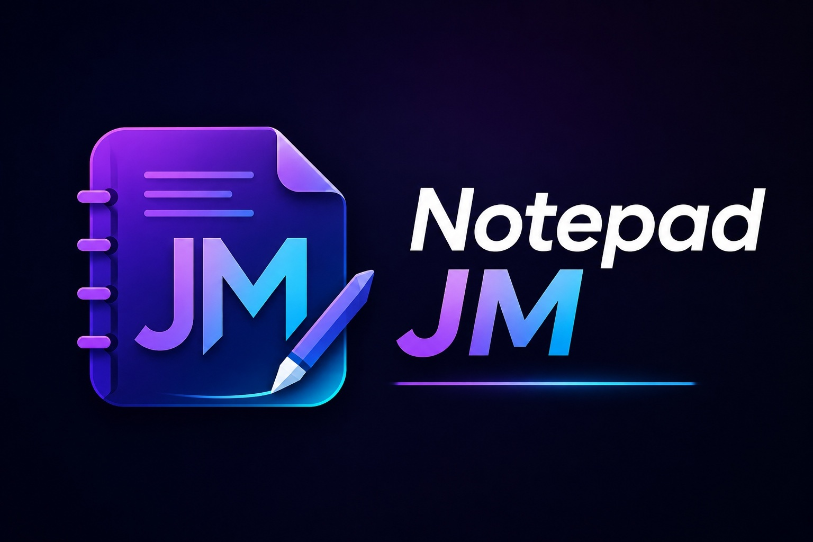

<p align="center">
  
</p>

<p align="center">
  
  
  
  
</p>

**Notepad JM** es un editor de texto moderno para Windows, desarrollado con **C#**, **WPF** y **.NET 10**.

El proyecto nació como una tarea de la asignatura **Diseño Centrado en el Usuario (SOF-010)** en ITLA y fue completamente reescrito para convertirlo en una aplicación de escritorio moderna, mantenible y apta para portafolio.

## 🎓 Información académica

| Dato | Información |
|---|---|
| 👨‍🎓 **Estudiante** | Francis Jairo Matías Rosario |
| 🆔 **Matrícula** | 2015-2984 |
| 📖 **Asignatura** | Diseño Centrado en el Usuario (SOF-010) |
| 👨‍🏫 **Profesor** | Juan Martínez López |
| 🏫 **Institución** | Instituto Tecnológico de Las Américas (ITLA) |
| 📅 **Período académico** | 2018-C1 |
| 📝 **Tipo de entrega** | Tarea académica |

> **Nota:** la entrega original fue una tarea de la asignatura, no un proyecto final.

## ✨ Funcionalidades

- Edición mediante múltiples pestañas con botón de cierre e indicador de cambios.
- Nuevo, abrir, guardar, guardar como y guardar todo.
- Guardado seguro mediante archivo temporal.
- Confirmación de cambios antes de cerrar.
- Apertura de múltiples archivos y prevención de duplicados.
- Arrastrar y soltar archivos sobre la ventana.
- Deshacer, rehacer, cortar, copiar, pegar y seleccionar todo.
- Buscar, reemplazar y reemplazar todas las coincidencias.
- Inserción rápida de fecha y hora.
- Ajuste de línea configurable.
- Zoom entre 8 y 48 puntos.
- Temas claro y oscuro.
- Corrector ortográfico integrado.
- Contador de líneas, palabras y caracteres.
- Barra de estado con ruta, línea, columna, codificación y zoom.
- Archivos recientes persistidos localmente.
- Recuperación automática de documentos sin guardar.
- Registro local de errores inesperados.
- Compatibilidad con TXT, Markdown, JSON, XML, HTML, CSS, JavaScript, TypeScript, C#, Java, Python y SQL.
- Atajos de teclado para las operaciones principales.

## 🧱 Arquitectura

La solución utiliza el patrón **MVVM** con servicios desacoplados para persistencia, diálogos, archivos y temas:

```text
Notepad-JM/
├── .github/
│   └── workflows/
│       └── build.yml
├── src/
│   └── NotepadJM/
│       ├── Assets/
│       ├── Commands/
│       ├── Models/
│       ├── Services/
│       ├── ViewModels/
│       ├── App.xaml
│       ├── FindReplaceWindow.xaml
│       ├── MainWindow.xaml
│       └── NotepadJM.csproj
├── .editorconfig
├── LICENSE
├── NotepadJM.sln
└── README.md
```

`MainWindowViewModel` coordina los documentos y comandos de la aplicación. Los servicios abstraen el acceso a archivos, la configuración local, la recuperación automática, los diálogos, el registro de errores y el cambio de tema. El code-behind queda limitado a responsabilidades propias de WPF, como el arrastre de archivos, la selección y la posición del cursor.

## 🛠️ Stack tecnológico

### 💻 Tecnologías principales

<p>
  
</p>

<p>
  
  
  
  
</p>

### 🧰 Entorno y herramientas

<p>
  
</p>

## ▶️ Ejecución

### Requisitos

- Windows 10 u 11.
- .NET 10 SDK.
- Visual Studio con soporte para .NET 10 y desarrollo de escritorio con WPF.

### Desde la terminal

```powershell
git clone https://github.com/Jairo0811/Notepad-JM.git
cd Notepad-JM
dotnet restore
dotnet run --project .\src\NotepadJM\NotepadJM.csproj
```

### Compilar

```powershell
dotnet restore .\NotepadJM.sln
dotnet build .\NotepadJM.sln -c Debug --no-restore
dotnet build .\NotepadJM.sln -c Release --no-restore
```

### Publicar una versión portable

```powershell
dotnet publish .\src\NotepadJM\NotepadJM.csproj `
  -c Release `
  -r win-x64 `
  --self-contained true `
  -p:PublishSingleFile=true
```

## ⌨️ Atajos principales

| Acción | Atajo |
|---|---|
| Nuevo documento | `Ctrl + N` |
| Abrir | `Ctrl + O` |
| Guardar | `Ctrl + S` |
| Guardar como | `Ctrl + Shift + S` |
| Guardar todo | `Ctrl + Alt + S` |
| Cerrar pestaña | `Ctrl + W` |
| Buscar y reemplazar | `Ctrl + H` |
| Insertar fecha y hora | `F5` |
| Acercar | `Ctrl + +` |
| Alejar | `Ctrl + -` |
| Restablecer zoom | `Ctrl + 0` |

## 🗂️ Datos locales

Notepad JM guarda sus preferencias, archivos de recuperación y registros en:

```text
%LOCALAPPDATA%\NotepadJM
```

Los documentos recuperables se eliminan después de guardarse correctamente o cerrar la aplicación de forma segura. Los errores inesperados se almacenan en `Logs` sin interrumpir el uso normal del editor.

## 🧭 Historia

La primera versión fue creada como una práctica académica básica con Windows Forms. La versión 2.0 reemplaza completamente esa implementación por una aplicación WPF moderna, conservando el propósito original del proyecto y demostrando su evolución técnica.

## 👨‍💻 Autor

**Francis Jairo Matías Rosario**  
Tecnólogo en Desarrollo de Software e Ingeniero de Software en formación.

## 📄 Licencia

Distribuido bajo la **MIT License**. Consulta el archivo [`LICENSE`](LICENSE) para conocer los términos.
